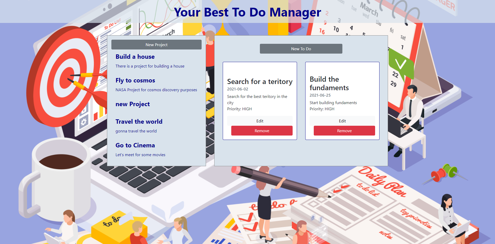

## Todo List- JavaScript

> This is the Todo List Project in [The Odin Project's](https://www.theodinproject.com/paths/full-stack-javascript/courses/javascript/lessons/todo-list) JavaScript Curriculum.

## Built With

- JavaScript, Webpack and Bootstrap

## Live version

[Todo List](https://frederickmih.github.io/TODO-LIST/)

## How it looks

## Getting Started

To get a local copy up and running follow these simple example steps.

- git clone `git@github.com:FrederickMih/TODO-LIST.git`
- cd into the `TODO-LIST`
- open `index.html`

### Prerequisites

- Get a browser like Chrome and Firefox in their most recent versions

### Install

- Install VSCode or any code editor you prefer

# Authors

👤 **Ilie Babcenco**

👤 **Mih Frederick**

## 🤝 Contributing

Contributions, issues and feature requests are welcome!

Feel free to check the [issues page](https://github.com/FrederickMih/TODO-LIST/issues).

## Acknowledgments

[The Odin Project](https://www.theodinproject.com)
[Microverse](https://www.microverse.org)

## Show your support

Give a ⭐️ if you like this project!